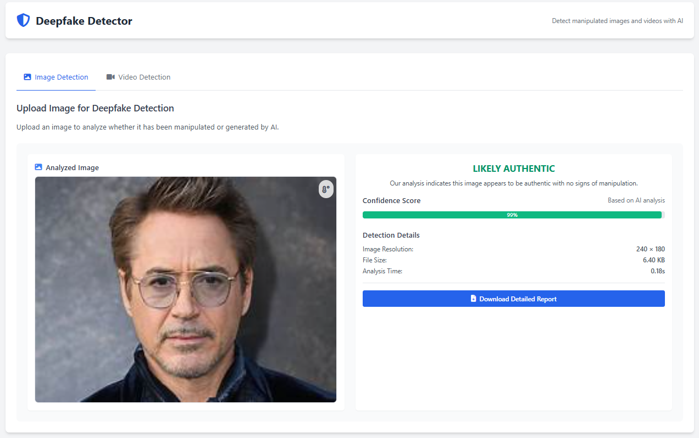
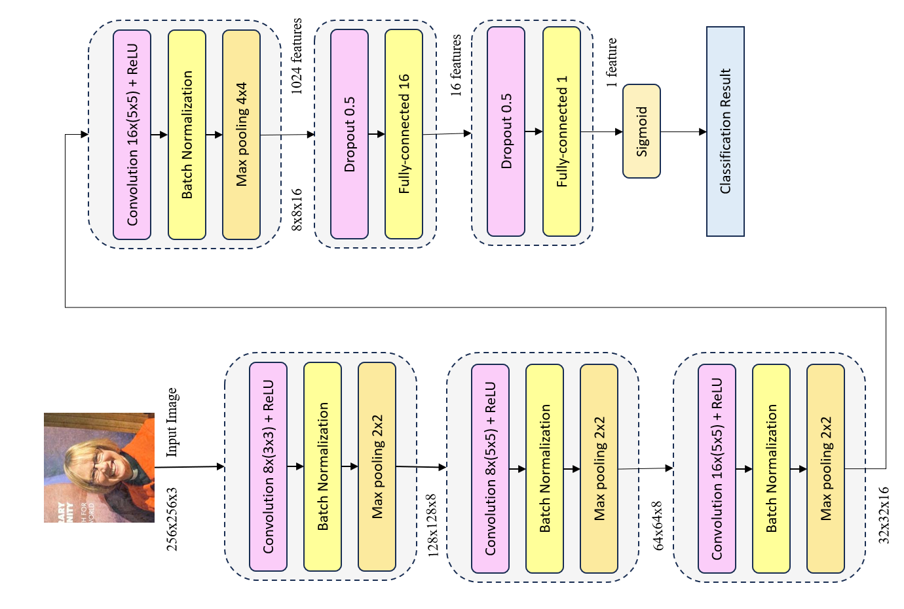
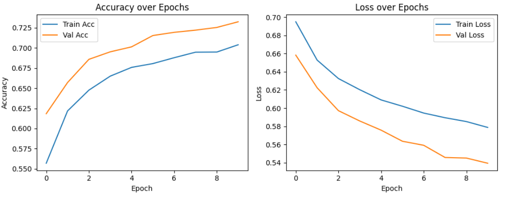
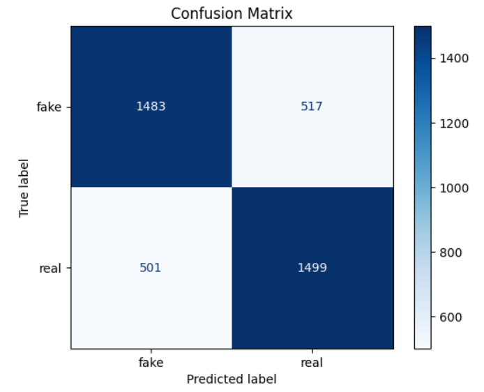

# DeepFake Detector — Django Web App 

This project is a deep learning–powered web application built with **Django** to detect deepfake media. It supports both **image** and **video** uploads and classifies them as **Real** or **Manipulated** using a fine-tuned version of the [MesoNet-4](https://github.com/DariusAf/MesoNet) architecture.


##  Features

-  Upload **images** or **videos**
-  Finetuned **MesoNet-4** model on a large real/fake dataset
-  Live classification with **confidence score bar**
-  Visualizations: Accuracy, Confusion Matrix, Architecture
-  Simple Django web interface for usability


##  Screenshots

###  UI – Upload & Prediction Interface

Below is the web interface of the application where users can upload an image or video file. The system analyzes the media and displays whether it is real or manipulated, along with a confidence score bar on side of it. You can also view the image heatmap. The below image shows the User interface:




### Model Architecture

This project is based on the MesoNet-4 architecture, a lightweight yet powerful CNN designed for detecting subtle facial manipulations. The architecture was modified and fine-tuned to improve detection accuracy on larger and more diverse datasets. The model was finetuned using various datasets that includes custon-made dataset, FaceForensics++ ..etc. The below image shows the architecture of the model: 




### Fine-tuning Accuracy & Loss Graphs

The following plot shows the model's training performance after fine-tuning. The accuracy and loss metrics indicate stable learning, with clear convergence over time. The fine-tuning is done to the model mesoNetD4.h5 model to as to generalize the model on various images. The metrics of the finetuning is shown in the figure below: 




### Confusion Matrix on Validation Set

Here is the confusion matrix from the validation set. It provides a visual summary of the classification results, showing true positives, true negatives, false positives, and false negatives. The confusion matrix of the model is shown in the figure below: 




##  Model Details

- Architecture: MesoNet-4 ([Original GitHub Repo](https://github.com/DariusAf/MesoNet))
-  Weights used: `mesonet4_DF.h5` (pretrained) + **custom finetuning**
-  Task: Binary classification — `Real` vs `Fake`
-  Dataset: Combined real/fake dataset from FaceForensics++, Celeb-DF, and other sources
-  Evaluation Metrics: Accuracy, Precision, Recall, F1-score, Confusion Matrix


##  Setup Instructions

### 1. Clone the repo

```bash
      git clone https://github.com/BhargavMupparisetty/Deepfake-Image-Detection.git
      cd deepfake-detector
```


### 2. Create and activate virtual environment

```bash
      python -m venv venv
      venv\Scripts\activate   # On Windows
      source venv/bin/activate  # On Linux/macOS
```

### 3. Run the Django app

```bash
   python manage.py runserver
```


Then visit:

```bash
 http://127.0.0.1:8000/
````


## Acknowledgements

 MesoNet-4: This project builds upon DariusAf/MesoNet, which provided the foundational model architecture.

 ### Datasets:
 
- FaceForensics++
- Celeb-DF
- DeepFakeDetection Challenge Dataset

 ### License
 
This project is licensed under the MIT License.

### Future Plans

- Add Grad-CAM or saliency map for explainability
- Add support for real-time webcam feed
- Host the web app in cloud

### Author
Developed by Bhargav Mupparisetty
